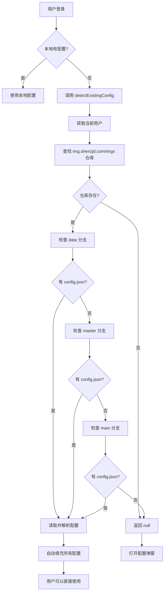

# 智能配置检测功能

## 功能说明

当用户登录后，系统会自动检测 GitHub 仓库是否已有配置文件（`.imgx-config/config.json`），即使 localStorage 中的配置丢失也能自动恢复完整配置。

## 检测逻辑

### 1. 本地配置优先

```typescript
const isConfigured = configStore.owner && configStore.repo && configStore.branch
```

如果 localStorage 中有完整的配置，直接使用本地配置。

### 2. GitHub 智能检测

当本地配置不完整时，系统会自动：

1. **获取当前用户信息**
   - 通过 GitHub API 获取登录用户的 username

2. **查找仓库**
   - 优先查找 `img.shenzjd.com` 仓库
   - 如果不存在，尝试查找 `imgx` 仓库
   - 如果都不存在，无法检测

3. **按优先级检测分支**
   检测顺序：`data` → `master` → `main`
   - 尝试读取 `.imgx-config/config.json` 文件
   - 如果文件存在，解析配置内容

4. **恢复配置**
   - 找到配置文件后，读取完整的配置信息
   - 包括：owner、repo、branch、directory、压缩设置、水印设置等所有配置项
   - 自动填充到 configStore

5. **配置失败**
   - 如果配置文件解析失败，继续检查下一个分支
   - 如果所有分支都没有配置文件，打开配置弹窗

### 3. 检测成功

如果检测到有效的配置文件，系统会：
- 自动填充完整配置到 `configStore`
- 显示成功提示：`已恢复配置: {owner}/{repo} ({branch})`
- 用户无需手动配置，直接可以使用
- **支持恢复所有配置项**：不仅是 owner/repo/branch，还包括压缩、水印、CDN 等所有设置

### 4. 检测失败

如果没有检测到配置文件，系统会：
- 打开配置引导弹窗
- 提示用户手动配置

## 检测的核心

### ✅ 检测配置文件，不是图片

系统检测的是 **`.imgx-config/config.json`** 配置文件，而不是图片文件。

这样设计的原因是：
1. **配置即代码**：配置文件本身就是用户的配置记录
2. **完整性**：配置文件包含所有配置项，不仅仅是分支信息
3. **精确性**：避免误判（仓库有图片但可能不是用于 ImgX）

### 配置文件示例

```json
{
  "owner": "your-username",
  "repo": "img.shenzjd.com",
  "branch": "master",
  "directory": "images",
  "compressionEnabled": true,
  "compressionQuality": 80,
  "watermarkEnabled": false,
  "cdn": "github",
  "useRaw": true,
  "copyFormat": "markdown",
  "autoCopyAfterUpload": true
}
```

## 支持的仓库名

系统会按顺序检测以下仓库名：
1. `img.shenzjd.com`（默认推荐）
2. `imgx`（备选）

## 检测的分支优先级

1. `data`（推荐给新用户的分支）
2. `master`（常用分支）
3. `main`（GitHub 默认分支）

系统会按这个顺序检查每个分支的 `.imgx-config/config.json` 文件。

## 优势

### ✅ 完整的配置恢复
- 不仅恢复 owner/repo/branch
- 还能恢复压缩、水印、CDN 等所有配置项
- 真正的"配置即代码"

### ✅ 容错性更强
- 用户清空 localStorage 后，只要 GitHub 上有配置文件就能恢复
- 支持多分支场景
- 自动适配不同用户的使用习惯

### ✅ 用户体验更好
- 无需重新配置，登录即用
- 支持 `data`、`master`、`main` 等多个常用分支
- 自动检测，无感知恢复

### ✅ 精确检测
- 检测的是配置文件，不是图片
- 避免误判仓库用途
- 确保恢复的是 ImgX 的配置

## 技术实现

### useDetectExistingConfig Hook

```typescript
const { detectExistingConfig, isDetecting, detectedConfig } = useDetectExistingConfig()

// 调用检测
const config = await detectExistingConfig()
if (config) {
  console.log('检测到配置:', config)
  // {
  //   owner: 'xxx',
  //   repo: 'img.shenzjd.com',
  //   branch: 'master',
  //   directory: 'images',
  //   compressionEnabled: true,
  //   compressionQuality: 80,
  //   ...
  // }
}
```

### 检测流程



## 修改的文件

1. **新增**：`src/hooks/useDetectExistingConfig.ts` - 配置检测 Hook
2. **修改**：`src/app/management/page.tsx` - 集成配置检测
3. **修改**：`src/app/page.tsx` - 集成配置检测

## 注意事项

- 检测过程可能需要 1-2 秒（取决于网络速度）
- 需要用户已登录且有有效的 GitHub token
- 检测的是 `.imgx-config/config.json` 文件，不是图片
- 如果找到配置文件，会恢复**所有配置项**，不仅仅是 owner/repo/branch
- 只在未配置时触发检测，不会重复检测

## 未来优化方向

1. **缓存检测结果**：将检测结果缓存到 sessionStorage，避免重复检测
2. **多仓库支持**：如果用户有多个 imgx 相关仓库，可以列出让用户选择
3. **进度提示**：在检测过程中显示加载状态
4. **手动触发检测**：在设置页面添加"恢复配置"按钮
5. **配置版本检查**：检查配置文件版本，支持配置格式升级
