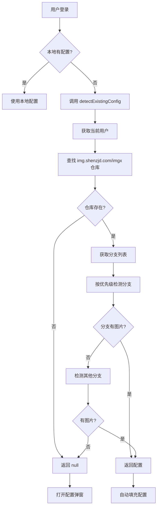

# 智能配置检测功能

## 功能说明

当用户登录后，系统会自动检测 GitHub 仓库是否已有配置数据，即使 localStorage 中的配置丢失也能自动恢复。

## 检测逻辑

### 1. 本地配置优先

```typescript
const isConfigured = configStore.owner && configStore.repo && configStore.branch
```

如果 localStorage 中有完整的配置，直接使用本地配置。

### 2. GitHub 智能检测

当本地配置不完整时，系统会自动：

1. **获取当前用户信息**
   - 通过 GitHub API 获取登录用户的 username

2. **查找仓库**
   - 优先查找 `img.shenzjd.com` 仓库
   - 如果不存在，尝试查找 `imgx` 仓库
   - 如果都不存在，无法检测

3. **获取分支列表**
   - 调用 `GET /repos/{owner}/{repo}/branches` 获取所有分支

4. **按优先级检测分支**
   检测顺序：`data` → `master` → `main`
   - 如果某个分支存在且有图片文件，立即返回该配置
   - 跳过没有图片的分支

5. **检查其他分支**
   - 如果优先分支都没有图片，检查其他分支
   - 找到第一个有图片的分支即返回

### 3. 检测成功

如果检测到有效的配置，系统会：
- 自动填充配置到 `configStore`
- 显示成功提示：`已恢复配置: {owner}/{repo} ({branch})`
- 用户无需手动配置，直接可以使用

### 4. 检测失败

如果没有检测到配置，系统会：
- 打开配置引导弹窗
- 提示用户手动配置

## 支持的仓库名

系统会按顺序检测以下仓库名：
1. `img.shenzjd.com`（默认推荐）
2. `imgx`（备选）

## 检测的分支优先级

1. `data`（推荐给新用户的分支）
2. `master`（你的使用习惯）
3. `main`（GitHub 默认分支）

如果这些分支都没有图片，系统会继续检查仓库中的其他分支。

## 优势

### ✅ 容错性更强
- 用户清空 localStorage 后，只要 GitHub 上有数据就能恢复
- 支持多分支场景
- 自动适配不同用户的使用习惯

### ✅ 用户体验更好
- 无需重新配置，登录即用
- 支持 `data`、`master`、`main` 等多个常用分支
- 自动检测，无感知恢复

### ✅ 灵活性高
- 可以检测任意分支（不仅是 data/master/main）
- 支持多个仓库名（img.shenzjd.com/imgx）
- 可扩展检测逻辑

## 技术实现

### useDetectExistingConfig Hook

```typescript
const { detectExistingConfig, isDetecting, detectedConfig } = useDetectExistingConfig()

// 调用检测
const config = await detectExistingConfig()
if (config) {
  console.log('检测到配置:', config)
  // { owner: 'xxx', repo: 'xxx', branch: 'master' }
}
```

### 检测流程



## 修改的文件

1. **新增**：`src/hooks/useDetectExistingConfig.ts` - 配置检测 Hook
2. **修改**：`src/app/management/page.tsx` - 集成配置检测
3. **修改**：`src/app/page.tsx` - 集成配置检测

## 注意事项

- 检测过程可能需要 1-2 秒（取决于网络速度）
- 需要用户已登录且有有效的 GitHub token
- 如果仓库很大（文件很多），检测时间会增加
- 只在未配置时触发检测，不会重复检测

## 未来优化方向

1. **缓存检测结果**：将检测结果缓存到 sessionStorage，避免重复检测
2. **多仓库支持**：如果用户有多个 imgx 相关仓库，可以列出让用户选择
3. **进度提示**：在检测过程中显示加载状态
4. **手动触发检测**：在设置页面添加"恢复配置"按钮
